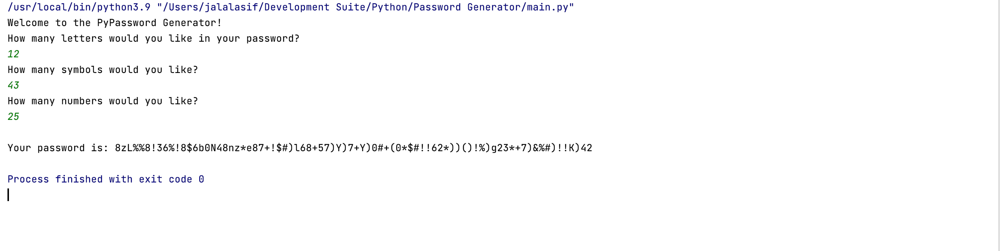
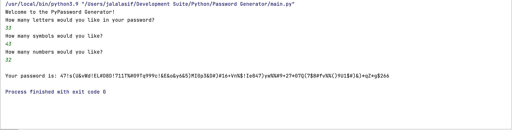

<h1> Password Generator</h1>

 This is a simple program written in python to generate passwords under a specified set of user constraints, i.e. it will ask the user on the number of 'characters', 'numbers' and/or 'letters' to be included in the password. 

Personally, this minor annoyance is what led me to writing this program. Websites these days have gotten increasingly tedious in terms of asking its users to pick passwords, and I get annoyed at my password manager not being able to come up with the kind of password I need (yeah, looking straight at you, Keychain. Fight me!).

Anyway, this program will seek to address that concern. I will update this project in the future with a GUI, just to, you know....make it pretty. Isn't that what really matters? Looking pretty? Glad we agree on that :).

Here are some screenshots displaying the ostentatious, glamorous, dazzlingly stylish simplicity of this program.....

<h3> And now for a completely useless fact. Because why not.</h3>

The "Hawaiian Pizza" was invented (or rather, arranged) by a Greek-Canadian man. Yeah, real prouda' you, sweetheart!

